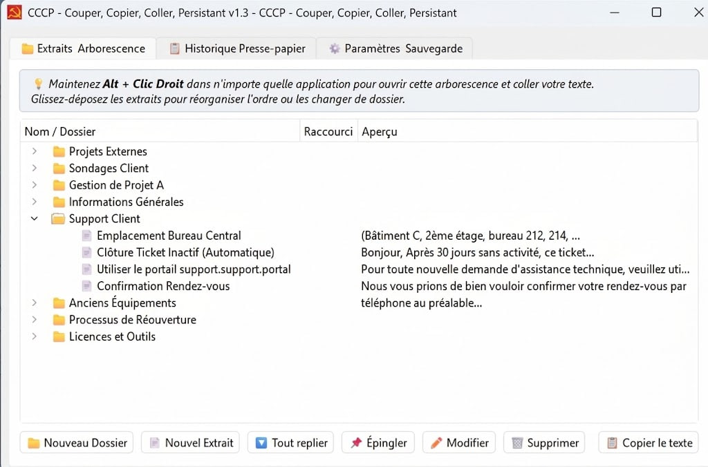

# ⚡ CCCP - Couper, Copier, Coller, Persistant (v1.3)

Application Windows portable de gestion intelligente et persistante du presse-papier et d'extraits textuels avec arborescence, raccourcis clavier globaux et menu flottant déclenchable au curseur (souris ou clavier).



---

## 📥 Téléchargement Direct (Version Portable Autonome)

👉 **[Télécharger CCCP v1.3 Portable (.ZIP)](https://github.com/john-lebrument/CCCP/releases/download/v1.3/CCCP_v1.3_Portable.zip)** *(Prêt à l'emploi, aucun installateur requis)*

1. Téléchargez et décompressez l'archive ZIP sur votre ordinateur ou clé USB.
2. Double-cliquez sur `cccp_1.3.exe` (ou `Lancer_cccp.bat`).
3. L'application se loge discrètement près de l'horloge Windows !

---

## 🌟 Fonctionnalités Principales

1. **Menu Flottant au Curseur** :
   - Dans **n'importe quelle application** (Word, Chrome, Outlook, Bloc-notes, VS Code, etc.), utilisez votre déclencheur souris (ex: `Alt + Clic Droit`, `Ctrl + Clic Droit`, `Clic Molette`...) ou un raccourci clavier global (ex: `Ctrl+Alt+V`, `Win+Num0`...).
   - Le menu arborescent s'affiche instantanément sous la souris.
   - Sélectionnez un extrait ou un élément récent du presse-papier : il est **automatiquement collé** dans votre champ de texte !

2. **Aperçu instantané au survol (1 seconde)** :
   - Survolez n'importe quel extrait ou historique dans le menu : une bulle d'aperçu flottante affiche le **texte intégral** sans troncature.

3. **Menu contextuel (Clic Droit) sur les éléments du menu** :
   - Clic droit sur un extrait pour **modifier directement le contenu**, **supprimer le raccourci** ou **supprimer l'extrait**.
   - Clic droit sur un élément d'historique pour l'enregistrer comme extrait ou le retirer.

4. **Raccourcis Clavier Globaux (Windows & Pavé Numérique inclus)** :
   - Assignez des raccourcis globaux (ex: `Ctrl+Alt+D`, `Win+Num1`..`Win+Num9`).
   - Saisie intelligente avec détection de la touche Windows et menu d'aide pour le pavé numérique.

5. **Arborescence & Extraits Épinglés** :
   - Classez vos snippets par dossiers et sous-dossiers.
   - Épinglez (📌) vos extraits favoris pour les retrouver en haut de liste.
   - Bouton en 1 clic pour **Tout replier / Tout déplier**.
   - Réorganisation libre par glisser-déposer.

6. **Historique Automatique & Dépôt direct** :
   - Historique paramétrable (10 à 500 éléments).
   - Clic droit sur l'historique > *📁 Déposer dans un dossier...* pour classer directement un texte copié dans l'arborescence.

7. **Portabilité & sauvegarde** :
   - Données locales autonomes dans `data/` (historique du presse-papier et extraits).
   - Export/Import JSON et compatibilité d'import CopyQ (`.cpq`).
   - Les données locales ne sont jamais incluses dans les archives de distribution.

> **Confidentialité :** CCCP enregistre localement l'historique du presse-papier et les extraits dans `data/clipboard_data.json`. Ce fichier est ignoré par Git et exclu des paquets portables publiés. Il est créé avec des valeurs par défaut au premier lancement.

---

## 🚀 Lancement & Compilation

### Lancement depuis les sources
```bash
pip install -r requirements.txt
python main.py
```

### Compilation en application portable autonome
```bash
python package_release.py
```
L'exécutable autonome `cccp_1.3.exe` est généré avec son icône officielle et son environnement complet.

---

## 📁 Structure du Projet

```
CCCP/
├── app/
│   ├── config.py             # Chemins, titre CCCP, paramètres
│   ├── storage.py            # Sauvegarde JSON, arborescence, export/import
│   ├── clipboard_manager.py  # Surveillance du presse-papier & collage
│   ├── win_hooks.py          # Crochets bas-niveau Windows (Souris & Hotkeys Win32)
│   └── ui/
│       ├── main_window.py    # Fenêtre principale (Extraits, Historique, Paramètres)
│       ├── popup_menu.py     # Menu flottant au curseur, aperçu hover & clic droit
│       ├── snippet_dialog.py # Dialogue création/édition d'extraits
│       ├── shortcuts_dialog.py # Vue d'ensemble de tous les raccourcis configurés
│       ├── shortcut_input_widget.py # Enregistreur intelligent Win + Pavé Num
│       └── tray_icon.py      # Icône de la zone de notification
├── Icone/
│   ├── icone.png             # Logo officiel CCCP
│   └── icone.ico             # Icône multi-résolutions Windows
├── tests/
│   └── test_smartclipboard.py# Tests unitaires automatisés
├── main.py                   # Point d'entrée de l'application
├── package_release.py        # Script de build PyInstaller & déploiement portable
└── requirements.txt          # Dépendances (PyQt6, Pillow)
```
